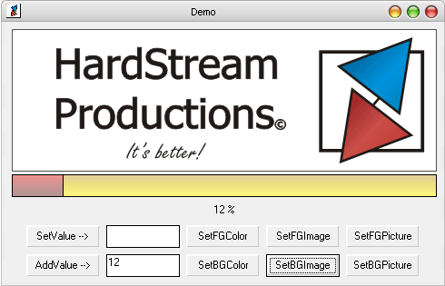



## Skinable Progress Bar 2\.0

### Description

This is a skinable ProgressBar

This is version 2.0.

© HardStream Productions
 
### More Info
 
Inputs are:

value, image, picture from Bg And Fg

Enjoy this ProgressBar!

currentvalue

A cool interface with your own progressbar image

             |
---                |---
**Submitted On**   |2004-07-21 10:34:18
**By**             |[Gh€ttoWarr\!or](https://github.com/Planet-Source-Code/PSCIndex/blob/master/ByAuthor/gh-ttowarr-or.md)
**Level**          |Beginner
**User Rating**    |4.9 (34 globes from 7 users)
**Compatibility**  |VB 6\.0
**Category**       |[Custom Controls/ Forms/  Menus](https://github.com/Planet-Source-Code/PSCIndex/blob/master/ByCategory/custom-controls-forms-menus__1-4.md)
**World**          |[Visual Basic](https://github.com/Planet-Source-Code/PSCIndex/blob/master/ByWorld/visual-basic.md)
**Archive File**   |[Skinable\_P1781058122004\.zip](https://github.com/Planet-Source-Code/gh-ttowarr-or-skinable-progress-bar-2-0__1-55523/archive/master.zip)

